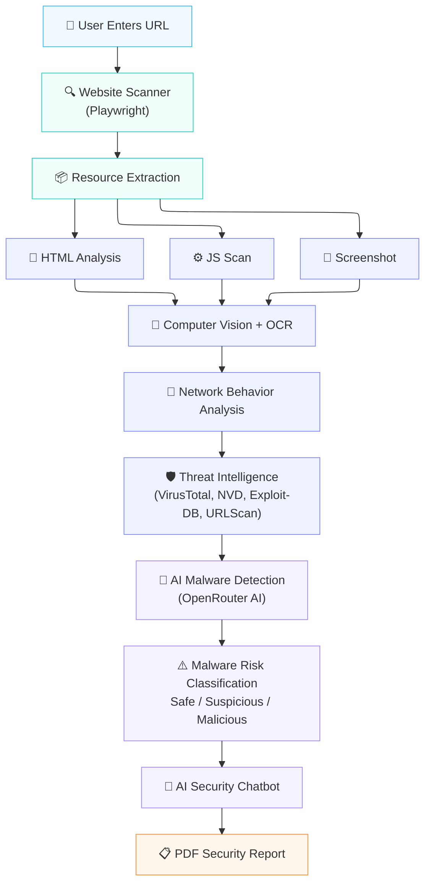

```mermaid
---
config:
  layout: elk
---
flowchart TD
    UserInput["👤 User Enters URL"]
    Scanner["🔍 Website Scanner<br/>(Playwright)"]
    ResourceExtract["📦 Resource Extraction"]
    
    HTMLAnalysis["📄 HTML Analysis"]
    JSScan["⚙️ JS Scan"]
    Screenshot["📸 Screenshot"]
    
    Vision["🤖 Computer Vision + OCR"]
    NetworkBehavior["📡 Network Behavior Analysis"]
    ThreatIntel["🛡️ Threat Intelligence<br/>(VirusTotal, NVD, Exploit-DB, URLScan)"]
    
    AIMalware["🧠 AI Malware Detection<br/>(OpenRouter AI)"]
    Classification["⚠️ Malware Risk Classification<br/>Safe / Suspicious / Malicious"]
    
    Chatbot["💬 AI Security Chatbot"]
    Report["📋 PDF Security Report"]
    
    UserInput --> Scanner
    Scanner --> ResourceExtract
    
    ResourceExtract --> HTMLAnalysis
    ResourceExtract --> JSScan
    ResourceExtract --> Screenshot
    
    HTMLAnalysis --> Vision
    JSScan --> Vision
    Screenshot --> Vision
    
    Vision --> NetworkBehavior
    NetworkBehavior --> ThreatIntel
    ThreatIntel --> AIMalware
    AIMalware --> Classification
    Classification --> Chatbot
    Chatbot --> Report
    
    classDef input fill:#f0f9ff,stroke:#38bdf8
    classDef scanner fill:#f0fdfa,stroke:#2dd4bf
    classDef analysis fill:#eef2ff,stroke:#818cf8
    classDef ai fill:#f5f3ff,stroke:#a78bfa
    classDef output fill:#fff7ed,stroke:#fb923c
    
    class UserInput input
    class Scanner,ResourceExtract scanner
    class HTMLAnalysis,JSScan,Screenshot,Vision,NetworkBehavior,ThreatIntel analysis
    class AIMalware,Classification,Chatbot ai
    class Report output
```
